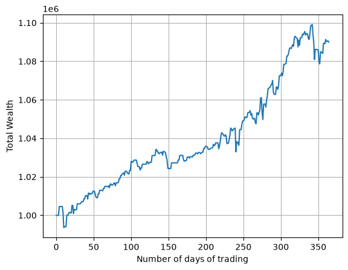

A research notebook that builds and **backtests a momentum strategy on the S&P 500** end to
end, driven by a **Geometric Brownian Motion (GBM)** model recalibrated every trading day.
Each day the model fits drift (μ) and volatility (σ) to a trailing one-year window of prices,
forecasts the index 10 days ahead with a 95% confidence band, and computes the **expected
shortfall** of that forecast. A long-only signal buys when the forecast sits above today's
price, and positions are sized so the worst-case tail loss stays within a fixed fraction of
wealth. Prices and positions live in a local **SQLite** database (`SP500.db`), rebuilt from a
vendored CSV, so the whole backtest runs offline and reproducibly.

> Conclusion:
> I learned how to turn a stochastic price model into a full trading loop: calibrating GBM
> from the mean and standard deviation of log-returns, projecting the price distribution
> forward, and reading risk off its lower tail via **expected shortfall** rather than a point
> forecast alone. I saw why calibration must use data *strictly before* each trading day to
> avoid look-ahead bias, and how **risk-based position sizing** — budgeting a fixed slice of
> wealth to the tail — automatically shrinks exposure when volatility rises. Most of all I
> learned to read the result honestly: the strategy earned a smooth **+9%** with a shallow
> **−1.9%** drawdown, but a conservative risk budget left most capital idle and it trailed a
> simple buy-and-hold in a strong bull market — low risk bought at the cost of return.

## What it does

**Data & preparation**
1. **Load prices**: read the tab-separated `SP500.csv` and bulk-insert it into a `prices` table (`prepare`, `csv.reader`, `executemany`).
1. **Seed the book**: create a `positions` table and initialize it with a $1,000,000 cash reserve dated before the first trading day.
1. **Shared connection**: open one `sqlite3` connection + cursor and share them across the program (`contextlib.closing`).

**The GBM model** (`class GBM`)
1. **Simulate**: generate price paths from the exact GBM solution with the −½σ² Itô correction (`simulate`, `np.cumprod`).
1. **Calibrate**: recover annualized μ and σ by inverting the mean and sample std of log-returns (`calibrate`).
1. **Forecast**: project the log-price T days ahead and exponentiate to a median forecast with a two-sided confidence band (`forecast`, `norm.ppf`).
1. **Expected shortfall**: the closed-form mean of the normal left tail — expected return *given* the worst 1−confidence outcomes (`expected_shortfall`, `norm.pdf`).

**Signal & sizing**
1. **Analyse a day**: calibrate a fresh GBM on the trailing 252-day window *strictly before* the date, then forecast 10 days ahead and its expected shortfall (`analyse`).
1. **Position size**: go long only when the forecast beats today's price, sizing shares so the tail loss ≈ 2% of current wealth (`position_size`).

**Backtest loop**
1. **Trade daily**: over 2020-06-01 → 2021-05-31, compare advised vs. held shares, execute the difference, adjust cash, and append the new position (`main`).
1. **Track record**: reconstruct daily wealth (`quantity × price + cash`) with a SQL self-join and plot it (`matplotlib`).

## Selected results

The backtest runs over **2020-06-01 → 2021-05-31** (311 daily marks, 203 trades) starting
from $1,000,000:

| Metric | Value |
| --- | --- |
| Final wealth | **$1,089,981** |
| Total return | **+9.00%** |
| Maximum drawdown | **−1.86%** |
| Trades executed | 203 |
| S&P 500 buy-and-hold (same window) | +38.22% |

**Low risk, bought at the cost of return.** The GBM momentum signal is directionally right —
wealth climbs steadily with a worst peak-to-trough dip of only **−1.9%** — but the conservative
2%-of-wealth tail budget keeps the book only ~40% invested at its peak, so most capital sits in
cash. Against a raging 2020–21 recovery that returned **+38%** to a simple buy-and-hold, the
strategy's **+9%** underperforms sharply. That gap is the lesson, not a bug: expected-shortfall
sizing deliberately trades upside for a shallow drawdown, and the risk budget is the first knob
to loosen (alongside the lookback window and confidence level) when experimenting.



## Run it

This project uses [pixi](https://pixi.sh) for a reproducible environment (Python 3.11–3.12):

```bash
pixi install
pixi run lab   # launches: jupyter lab --no-browser --port=7772
```

> **Used:** python · numpy · scipy · sqlite3 · matplotlib

See [`momentum-based-algorithmic-trading-program.ipynb`](momentum-based-algorithmic-trading-program.ipynb) for the complete analysis.
